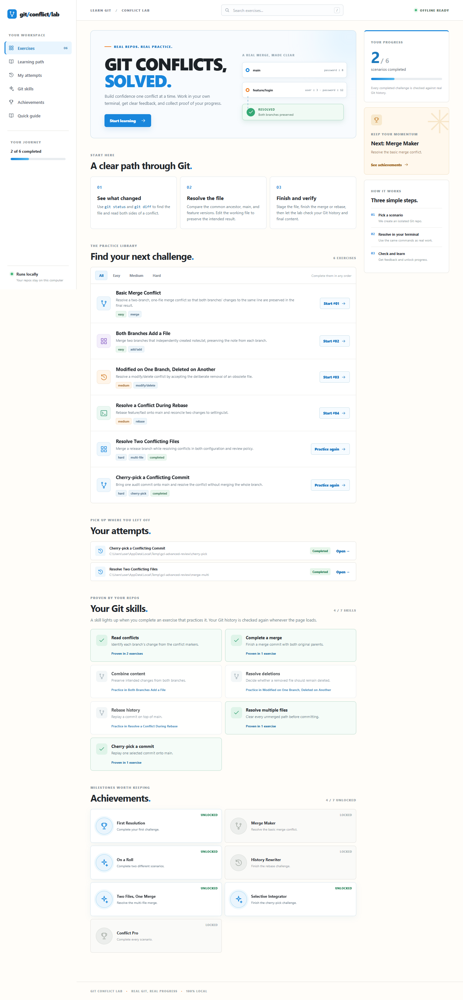
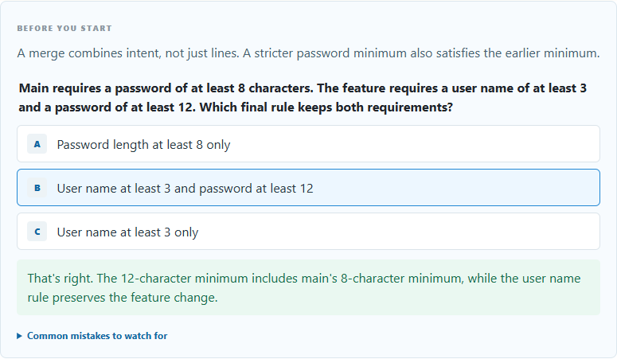
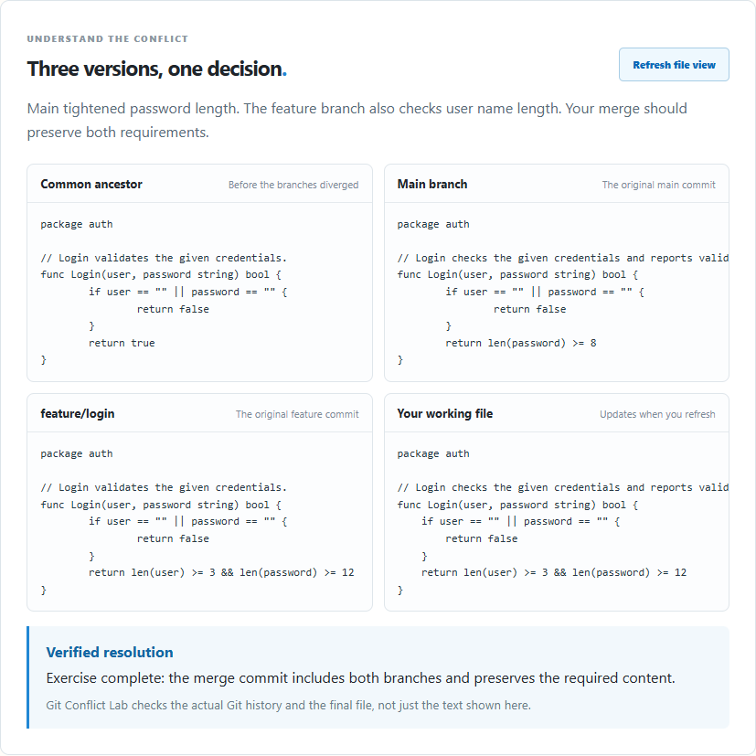
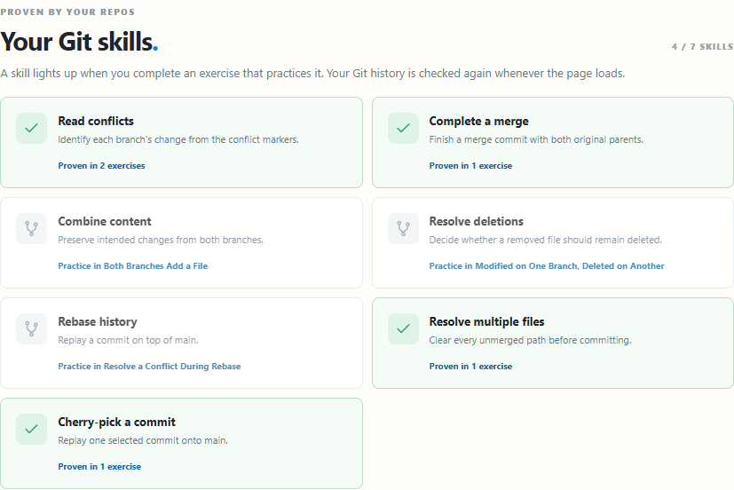
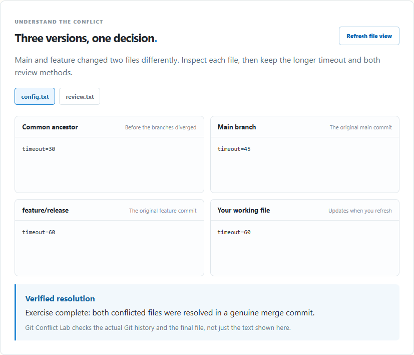

# One-minute demo

Git Conflict Lab creates a real, isolated Git repository for each exercise. The learner resolves the conflict in a terminal; the browser explains the branches and checks the actual result.

## Try the first challenge

1. Run `go run ./cmd/git-conflict-lab ui` and open the printed localhost address.
2. Choose **Basic Merge Conflict**. Read the short concept, answer its knowledge check, and open the common mistakes list if you need it. The workspace shows the repository path and the command to trigger the conflict.

3. In that repository, run `git merge feature/login`. Git pauses on `login.go`.
4. Click **Refresh file view**. Compare the common ancestor, `main`, `feature/login`, and the working file with conflict markers.
5. Resolve `login.go` so it rejects empty credentials and requires a user name of at least 3 characters and password of at least 12. Run `git add login.go` and `git commit`.
6. Click **Check my solution**. The lab checks the merge commit, both original parents, a clean worktree, and the resulting Go expression. Completion unlocks achievements that remain visible after reload.

## What the project demonstrates

- Go CLI and localhost UI with no external service or account.
- Deterministic generation of real Git histories for six conflict scenarios, including multi-file merge and cherry-pick.
- Read-only inspection of original Git objects and the learner's current file.
- Scenario-specific verification that checks Git history and final content without executing learner code.
- Repeatable attempts, progressive hints, responsive UI, and a skill map and achievements reconstructed from verified attempts.

The multi-file exercise lets learners switch between both conflicting files while comparing the original branches:

The checker and inspector are in `internal/lab/`; the local API and embedded interface are in `internal/webui/`. Run `go test ./... -count=1` to execute the automated tests.
